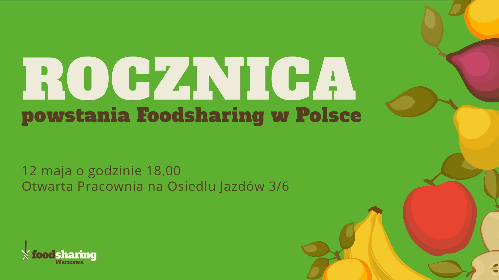
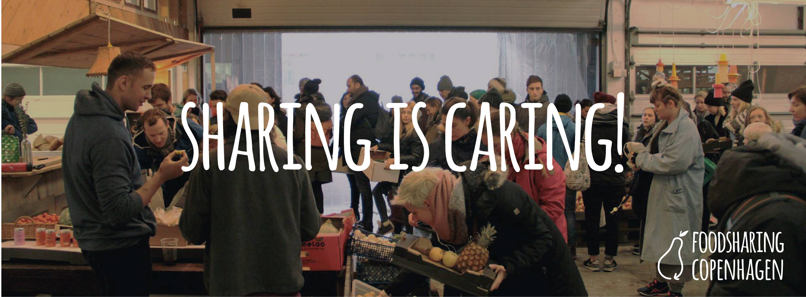
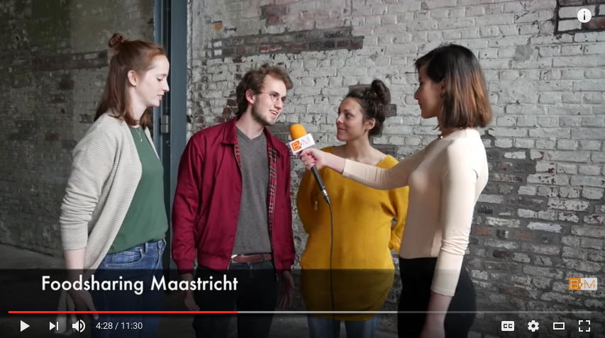

**The yunity heartbeat** - news from the world of sharing, fresh every two weeks.

## Foodsaving Worldwide

### News from foodsaving groups 

* We renewed the contact to foodsharing Edinburgh, just to find out that it already is [foodsharing Scotland](http://www.foodsharing.scot/) - with active foodsaving projects in Aberdeen, Glasgow and Dumfries as well! In Edinburgh they maintain cooperations with 17 businesses, hold various distribution events every week and up to three Disco Soup events a year. On top of that they received government funding and are holding workshops now to educate students about sustainable cooking. Way to go, Scottish foodsavers! :D
* On the 12th foodsharing Warsaw [celebrated their first anniversary](https://www.facebook.com/events/129721877573917/) with a little get-together of foodsavers and supporters. There was saved food and shared pride in all the success that was already reached over the past year. Congratulations foodsharing Warsaw! :D

* [Janina](https://yunity.atlassian.net/wiki/spaces/~Janina) met up with Hangshuen, who started [foodsharing Hong Kong](https://www.facebook.com/foodsharinghk/), and will hopefully soon get to read the complete report that she wrote about this endeavor - if we're lucky we'll even get permission to translate and publish it on [foodsaving.today](https://foodsaving.today).
* Stefan from [foodsharing Taiwan](https://www.facebook.com/foodsharingtaiwan/) was also part of the little gathering and will go back to Taiwan soon. The plan is, that him rearriving at the island and putting in some energy will speed up the growth of the local foodsharing project again.
* Francois from Copenhagen wrote a mail to us and asked for more info concerning the foodsaving tool. Maybe this model foodsharing project will use our software soon, too! ;) On top of that, we're always happy to receive more direct news, that we can share with you, instead of just linking to their very active and anglophone [facebook group](https://www.facebook.com/groups/foodsharingcopenhagen/).

* [foodsharing Bilbao](https://www.facebook.com/groups/1853289058224368/) is as active as ever, continuing daily pick-ups, as well as weekly distribution events in two different locations. Unai also sent us a draft for his blog post on [foodsaving.today](https://foodsaving.today), so stay tuned for more detailed information!
* [foodsharing Maastricht](https://www.facebook.com/FoodSharingMaastricht/) is picking up food, filling their Food-Share Points and just now is participating in a local event named [The WE Festival](https://www.facebook.com/events/236869946766836/). In the process of their university's sustainability week, they were also featured in a small report, that you can [watch on YouTube](https://www.youtube.com/watch?v=WHn1vn3jHHU#t=04m23s).

* Luis Tamayo came back to Janina on facebook and told her that [foodsharig Madrid](https://www.facebook.com/groups/721992124580044/) was not lead by the same people as at the time, when the facebook group was created. Still, he was quite certain, that there are still people saving and sharing food in Madrid and he was totally open to give the rights to the group to other people, who are more active in that regard now. He himself is now working for [OuiShare](http://ouishare.net/en), so you could say he stayed true to the general topic... ;)

### [foodsaving.today](https://foodsaving.today)

The third part of the series from Gothenburg was published. This time Bruno talks about the more technical side of their foodsaving operation: Which tools to use for what and how to communicate. He also talks about his experience with our foodsaving tool! :3 [Click here](https://foodsaving.today/en/blog/2017/04/27/foodsharing-gothenburg-part3) to read all about it!

### [foodsaving.world](https://foodsaving.world)

- Draft of a [crash course into the foodsaving tool](https://github.com/yunity/foodsaving-docs/blob/master/foodsaving-tool-intro/README.md)
- Group and store locations can now be set via a [simple click on the map](https://github.com/yunity/foodsaving-frontend/pull/441) - thanks to [Lars](https://github.com/D0nPiano)  
Best practice: first enter the address in the text field above the map, then select an entry. If necessary, adjust the location either via clicking or dragging the marker and edit the address (but do not select an entry this time).
- The button to go back to the store page is now [an arrow](https://github.com/yunity/foodsaving-frontend/pull/481) - thanks to [Jérôme](https://github.com/jeromechrist)!
- Code refactoring
  - Layouts are now [fully-fledged components](https://github.com/yunity/foodsaving-frontend/pull/473)
  - Upgraded to [Webpack 2](https://github.com/yunity/foodsaving-frontend/pull/491)
  - PickupList code is [now more angular-ish](https://github.com/yunity/foodsaving-frontend/pull/420)
  - Our `*.styl` files are now [checked by a linter](https://github.com/yunity/foodsaving-frontend/pull/493) - but without complaining about mistakes (yet)

## Harzgerode

Many yuniteers, as well as other people from our shared bubble of sustainability, ecoliving and sharing are still gathered at Harzgerode. They are working on the house (e.g. the sewage plant on the compound is a hot topic these days), on their own projects and on sustaining the local community - which is everchanging but apparently existing nevertheless.

There is a cooperation with a local supermarket for example. It was established because two of our people were discovered while dumpster diving, the police was called and thus contact with the management of the store was established. What could have turned out badly actually was a great opportunity: After talking to the manager and pointing out the madness of food waste, the open and socially positive nature of our projects and the simple possibility to make each other's lives easier, he agreed to let us pick up the surplus food on a regular basis. Now we can come there three times a week and do official pick-ups, without the need to climp into the dumpster! :D

## yunity Website

We have talked about it for a long time, but now we finally did it: **We have a new website!**
In case you haven't noticed so far: The page you are currently on is *not* our wiki, but our own, cleansed and redesigned yunity.org!

We got rid of a lot of outdated content and listed the concrete subprojects that have formed and are pursued in yunity. Of course there's more info available on every one of these topics (depending on the project it can be *a lot*!), but we decided not to clutter our website with it and rather put collections of links, so that everyone can decide for themselves which topic to spend more time on and which link to follow.

Do you have any feedback on our new page? Please tell us in [#website](https://yunity.slack.com/messages/C0FPKA5U2/) on [Slack](https://slackin.yunity.org/)!

## About the heartbeat.

The heartbeat is a biweekly summary of what happens in yunity. It is meant to give an overview over our currents actions and topics.

### When and how does it happen?

Every other weekend we collect information on a wiki page and publish it on Sunday or the following Monday as a wiki blog article.

Afterwards we add a nice abstract and share it on [facebook](https://www.facebook.com/yunity.org/).

### How to contribute?

Talk to us in [#heartbeat](https://yunity.slack.com/messages/heartbeat/) on [Slack](https://slackin.yunity.org) about the content, the layout or any other heartbeat related issues and ideas!
