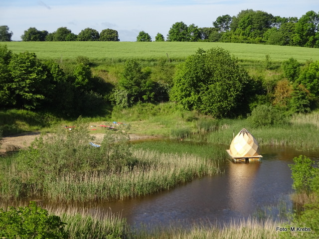
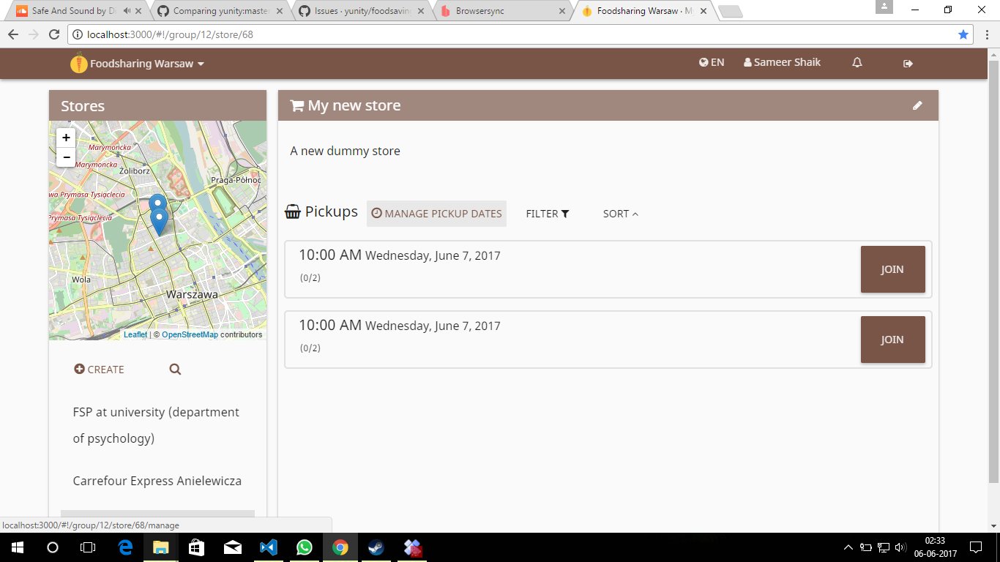

**The yunity heartbeat** - news from the world of sharing, fresh every two weeks.

## Multisharing platforms

### Online

Thanks to the new energy brought in by Bruno and the enthusiastic movement in Gothenburg, we're talking about building online multisharing services again. On June 4th we held a call to discuss the basic concept and share ideas on how to proceed. Some of the questions raised were the following:
* app or website?
* one central service provided by us or individual local instances?
* 

### Offline

The offline version of a multisharing platform currently in use is the flake. The flake is an installation, that gives space for people to offer and look for things, skills, spaces, ideas and whatever you can imagine. It's like a small, local, offline version of the full-fledged yunity platform... ;) So it is a way for people to connect and share whatever they like in their direct environment. This year the flake will travel to various festivals and maybe even city centers. Over this journey the concept will be improved so that people can make use of it as easily and conveniently as possible.

## Festivals

During the summer lots of festivals take place and provide us with great opportunities to network, learn and save resources in a fun and social environment!

### Humus Festival

From the 4th to the 11th of June the [Humus Festival](http://humus-festival.de/) took place at [Kulturgut Freiland](http://kulturgut-freiland.de/gelaende/) in the North-East of Germany. It was meant to bring together people from the different but related backgrounds of foodsharing, permaculture and wilderness awareness - and that's exactly what it did! It was a week full of interesting workshops treating all kinds of subjects from Thai massage to Bokashi composting, from sensing nature to sewing wounds and from hypnosis to baking bread. Every day we were fed three amazing vegan/vegetarian meals, that were made partly from saved food. Butze was there from the very beginning and made sure a [flake](https://www.youtube.com/watch?v=73SRZKvHqUA) was installed to enable people to share whatever they want directly on the spot - without the need for any kind of online platform.
We bathed in the lake, we sweat in the floating sauna and we sang at the fire. And just like that a lot of new connections were established, so that there is e.g. a newly found - and hopefully growing! - network of people in Berlin, who are united by the need to build something bigger, that is beneficial for the city, the people and the world. Do you want to join in as well? Then visit the [humus forum](http://humus-festival.de/forum/index.php), create an account and take part! ...or tell Janina on Slack and she will connect you! ;)

### MOVE Utopia

Next week the [MOVE Utopia conference](http://move-utopia.de/wp-content/uploads/2017/03/Aufruf_eng.pdf) will take place in Berlin and bring together lots of different movements working for social and ecological change. Some of us have been involved in organizing this big event from the very beginning, so we're looking forward to amazing outcomes, which then will be covered by a whole specialized issue of the [Oya magazine](http://www.oya-online.de/home/index.html)!

### Foodsharing.de festival season

With the Hurricane and Southside festivals taking place in two weeks in the North and South of Germany respectively, the festivals season for German foodsavers is opening as well! Let's save tons of food, tents, camping chairs, sleeping bags and all the other camping supplies, like sunscreen, toothpaste! And all the good beer can't go to waste either, of course... ;)

## Foodsaving Worldwide

### News from foodsaving groups 

### [foodsaving.today](https://foodsaving.today)

### [foodsaving.world](https://foodsaving.world)

In our [Slack chat](https://slackin.yunity.org), we started to gather priorities for upcoming feature development. The following points were mentioned:
- comment field for the pickups ([more info & feedback on this](https://github.com/yunity/foodsaving-frontend/issues/158))
- e-mail notifications ([more info & feedback on this](https://github.com/yunity/foodsaving-frontend/issues/257))
- social features: messaging and forum ([more info & feedback on this](https://github.com/yunity/foodsaving-frontend/issues/520))
- optional hierarchy system, that allows for rights distribution ([more info & feedback on this](https://github.com/yunity/foodsaving-frontend/issues/356))

The following features have been implemented during the last two weeks:

- On the store page, the *create pickup* button has been replaced with a *manage pickup dates* button, increasing the accessibility of the page ([details](https://github.com/yunity/foodsaving-frontend/pull/512)) 
- A history tab has been added to the Store page, showing all activity related to the selected store ([details](https://github.com/yunity/foodsaving-frontend/pull/516))
- The user profile pictures in the history tab now show the user's initials on top of the random picture ([details](https://github.com/yunity/foodsaving-frontend/pull/513))
- The date selector for creating and editing pickups now only allows clicking on today or days in the future ([details](https://github.com/yunity/foodsaving-frontend/pull/517))
- After verifying a changed mail address, now the new address gets shown in the frontend ([details](https://github.com/yunity/foodsaving-frontend/pull/510))
- Code refactoring: As usual, a significant portion of our time went into making the code more uniform, better to understand and hence easier to contribute to
  - migrate to the `SessionUser` service, which also provides a  `isLoggedIn` helper function ([details](https://github.com/yunity/foodsaving-frontend/pull/511))
  - change `*.styl` files to uniform code style ([details](https://github.com/yunity/foodsaving-frontend/pull/514))

## About the heartbeat.

The heartbeat is a biweekly summary of what happens in yunity. It is meant to give an overview over our currents actions and topics.

### When and how does it happen?

Every other weekend we collect information on a wiki page and publish it on Sunday or the following Monday as a wiki blog article.

Afterwards we add a nice abstract and share it on [facebook](https://www.facebook.com/yunity.org/).

### How to contribute?

Talk to us in [#heartbeat](https://yunity.slack.com/messages/heartbeat/) on [Slack](https://slackin.yunity.org) about the content, the layout or any other heartbeat related issues and ideas!