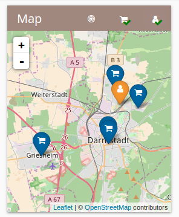

**The yunity heartbeat** - news from the world of sharing, fresh every two weeks.

## [foodsharing.de](https://foodsharing.de)

## [foodsaving.world](https://foodsaving.world)

Ines and Marie from RGSoC are [working to finalize](https://github.com/yunity/foodsaving-backend/issues/253#issuecomment-318612543) the [pick-up feedback feature](https://github.com/yunity/foodsaving-frontend/issues/159) on the back-end, while Lars already created [an user interface draft](https://github.com/yunity/foodsaving-frontend/pull/581).

In an activity surge, Nick made much progress on [his back-end implementation](https://github.com/yunity/foodsaving-backend/pull/333) of the _Conversations_ feature, awaiting review now. Whilst working on that, he also had the idea to improve the test infrastructure, namely [watching files for changes and running only affected test](https://github.com/yunity/foodsaving-backend/pull/334). All that to boost our test coverage further up, even it's [already on 98%](https://codecov.io/gh/yunity/foodsaving-backend)!

### Further changes and improvements

- Users can add their location, members of the group can see where other members are located. This feature is meant to improve pick-up coordination and sharing of food.
- The store overview map got much more responsive: it zooms to the currently selected store and shows other stores and users with reduced opacity

- The location input is now the same on group, store and user forms and the visibility of the address search field has been improved
- "Home" button added to all pages that links to the landing page
- Store list gets now sorted by name
- Bug fix: store map was sometimes not visible when the store didn't have an address
- Refresh data from the server when clicking on stores and the group. If two users were modifying data, it could lead to outdated values before. 
- Fix "blank page" bug when user is logged out or URL is invalid. It redirects to the login page now.
- The backend development setup should be easier now thanks to [the Dockerfile](https://github.com/yunity/foodsaving-backend/pull/331) created by Ines, Marie and their coaches.
- `Django-channels` for doing _websockets_ were added in preparation of the _Conversations_ feature
- When signing up, E-Mail addresses are now [considered case-insensitive](https://github.com/yunity/foodsaving-backend/pull/327) to prevent errors. For example, `test@example.com` and `Test@example.com` can't be used at the same time.
- The API documentation is now only available via `/docs/`, e.g. [foodsaving.world/docs/](https://foodsaving.world/docs/), while `/api/` returns raw `JSON` data.

## News from foodsaving groups

An [article about Foodsharing Maastricht](https://foodsaving.today/en/blog/2017/07/29/foodsharing-maastricht-discovery) was added to [foodsaving.today](https://foodsaving.today):

> Recently, we picked up food from three smaller supermarkets on a regular basis and we started to cooperate with the food supplier of the university, which already greatly improves the sustainability of our university. On a national level, we just joined the Dutch-wide Foodsharing foundation, which was also just recently founded.

## [Kanthäuser Wurzen](https://yunity.org/en/wurzen)

The buildings on Kantstraße go steadily forward... There are some holes in the old bitumen roof which were not sealed with one coat of bitumen paint, another layer will be added when the necessary equipment is in place. 

A first event was held to meet the neighbors over cake and coffee and although not many came it was nice and/or informative to meet up. Connections were also made to local initiatives such as [Mehr Generationen Haus](https://www.mehrgenerationenhaeuser.de/), [Netzwerk für Demokratische Kultur](http://www.ndk-wurzen.de/), local Kleingärten (allotments) and another local housing project. 

Janina, Laurina, Doug and Matthias formally associated a project group in order to coordinate without having a boss or privatizing the resource, documents in public soon. There are 5 new house plants and people seem pretty happy.

## [Gemeinschaftsstifter Harzgerode](https://www.gemeinschaftsstifter.info/)

---

## About the heartbeat.

The heartbeat is a biweekly summary of what happens in yunity. It is meant to give an overview over our currents actions and topics.

### When and how does it happen?

Every other weekend we collect information on a wiki page and publish it on Sunday or the following Monday as a wiki blog article.

Afterwards we add a nice abstract and share it on [facebook](https://www.facebook.com/yunity.org/).

### How to contribute?

Talk to us in [#heartbeat](https://yunity.slack.com/messages/heartbeat/) on [Slack](https://slackin.yunity.org) about the content, the layout or any other heartbeat related issues and ideas!
