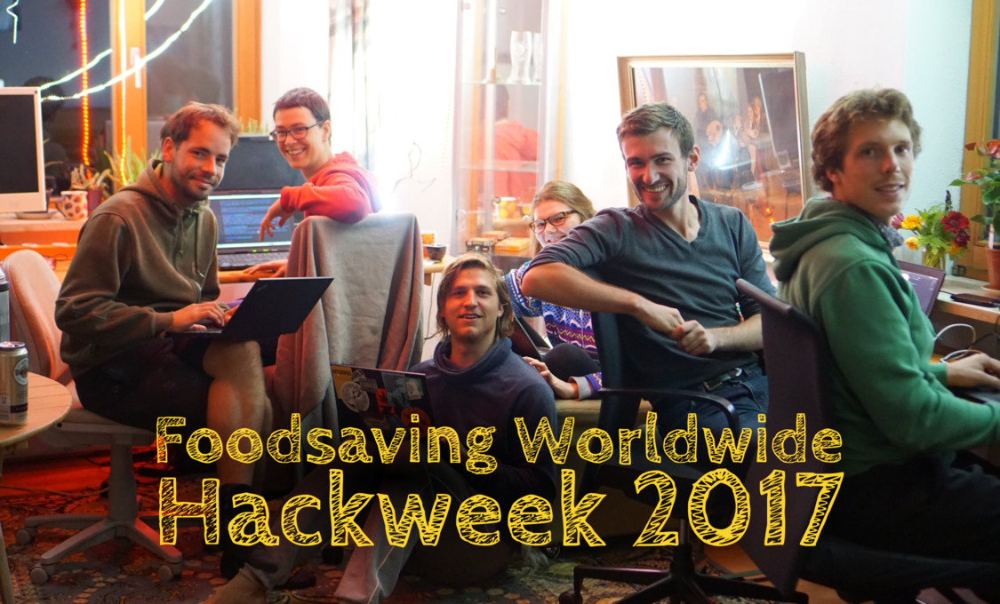
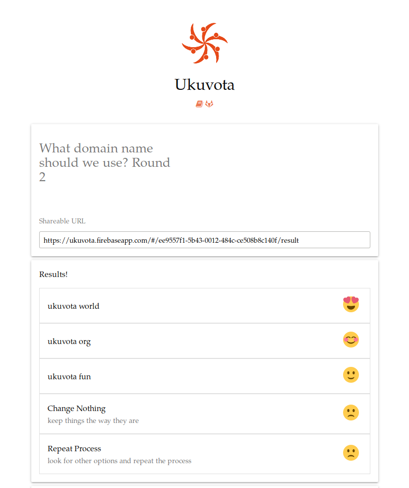
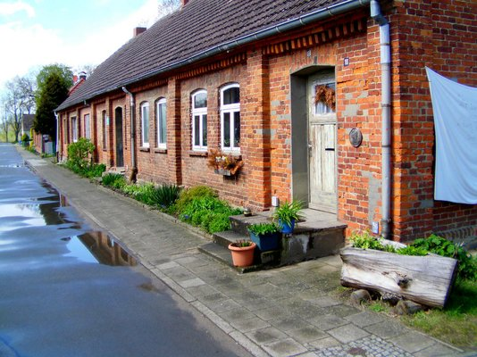

**The yunity heartbeat** - news from the world of sharing, fresh every two weeks.

## Foodsaving Worldwide Summer Camp / Hackweek
The whole of the [foodsaving tool team](https://blog.foodsaving.world/team.en.html) and more gathered in Neuried to work on progressing code, improving structure and clarifying questions of identity with regards to [foodsharing.de](https://foodsharing.de). Productivity is high and the event is going on still!

===

## [foodsaving.world](https://foodsaving.world)

### [Karrot](https://github.com/yunity/karrot-frontend/) - _the former foodsaving tool_
The many names with 'food' are confusing and 'foodsaving tool' is not the most catchy name there is, right? So we started a sore voting process to come up with a better name. The winner was *Karrot* and we will never talk about the 'foodsaving tool' again... ;)

#### Switch of frontend frameworks
We started off with AngularJS 1 and since had many discussions about it. Now things changed, as Angular Material doesn't seem to be updated anymore. That's why we started a [big evaluation of frontend frameworks](https://github.com/yunity/karrot-frontend/issues/593) and used this hackweek to fix the decision of using Vue.js and Quasar in the future.

The biggest change probably is the use of [Vuex](https://vuex.vuejs.org/en/intro.html), which allows for global state management and nicer data flow solutions. A lot of refactoring and rewriting is about to happen now, but we're postive that it will prove useful in the long run. Also, we use the productivity boost of being in one spot to get done as much as possible in the smartest possible way.

### [foodsharing.de](https:foodsharing.de) development
Having Clara with us in Neuried opened up a lot of talks about the future of foodsharing.de.
* Nick presented his idea to get the beta tester group active again, and to make coders who propose changes more responsible for their contributions, so that Matthias will not be the one having to find and fix the problems that new contributions cause sometimes. The idea is that the original contributor talks to the beta tester and that these two together try fixing potential bugs without directly bugging Matthias.   This would lead to more general progress, because Matthias would be less hesitant to accept changes.
* Open sourcing is discussed in-depth and might probably be done sooner than it was planned...

### [Ukuvota](https://ukuvota.world/)
yunity.org has a new subproject listed! It is the score voting app  Ukuvota (the name is Zulu for 'voting') and if you want to contribute, feel free to have a look at the [gitlab repo](https://gitlab.com/ukuvota). The main contributor Wolfi is all alone so far... :)

The first version just got deployed and is now [ready for testing](https://ukuvota.world/)! Please report any bugs you might encounter. (Be aware of the fact that, all data is public, do not add confidential data)

## [foodsaving.today](https://foodsaving.today)
Peter wrote a nice summary of how [foodsharing Switzerland](https://foodsaving.today/en/blog/2017/09/15/foodsharing-switzerland-status-quo) works and what they are up to. It was initially posted on foodsharing.de, now got translated and made accessible on foodsaving.today as well.

## Dargeluetz
Ever heard of 'WuppDays'? No? Well, they used to be a thing a while ago and it seems we'll bring them back!
Joachim, Janina and Lisa are thinking of gathering people in Dargeluetz in November to:

**Hold a meetup of communities**
* network between existing and potential communities
* open a space for communities to present themselves
* make it easier for people who want to join a community to find the right one

**Build foodsharing Parchim/Dargeluetz**
* talk to stores and convince them to start cooperations
* carry out pick-ups and gain experience

**Discuss and plan the future of [the Flake](http://flake.world/)**
* plan how to make the most of the time at this year's ccc
* reflect on the experiences gained during the summer

**Work on your own useful projects, that benefit society**
* take advantage of the productive atmosphere and get things done
* enjoy the communal spirit and the energy in a group of like-minded people

## Kanthaus
The Kanthaus project is moving forward as we speak:
* Thanks to Wolfi, we now have a [Kanthaus website](https://kanthaus.online/en/). You can read all our important documents there, like the [Community Constitution](https://kanthaus.online/en/docs/constitution/), the [Collective Agreements](https://kanthaus.online/en/docs/collectiveagreements/), the [Information for Visitors](https://kanthaus.online/en/docs/visiting/), as well as all the minutes from our weekly Coordination Meetings; [these](https://kanthaus.online/en/meetings/2017-09-18_come/) are the most recent ones. (Janina started translating the page to German, but didn't cover the important documents so far. Sorry...^^)
* On September 7th we had an appointment with the mayor, who turns out to be super supportive of our ideas! He already came back to us with the hint of some funding we could apply for, is open to us holding semi-public events as we see fit and thinks positive of having FSPs in public places. This seems to be the beginning of a wonderful friendship! ^_^
* Foodsharing Wurzen started and we already were able to find three cooperating businesses! On September 25th we will hold an official kickoff meeting, where we invite other interested people to help them become foodsavers.

_by Janina_
