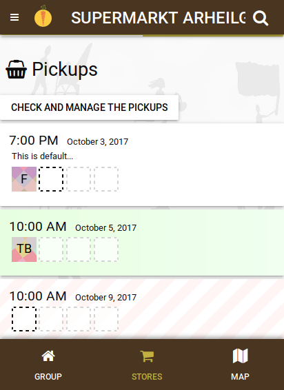
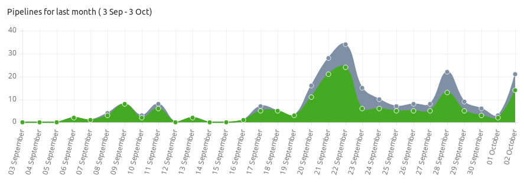
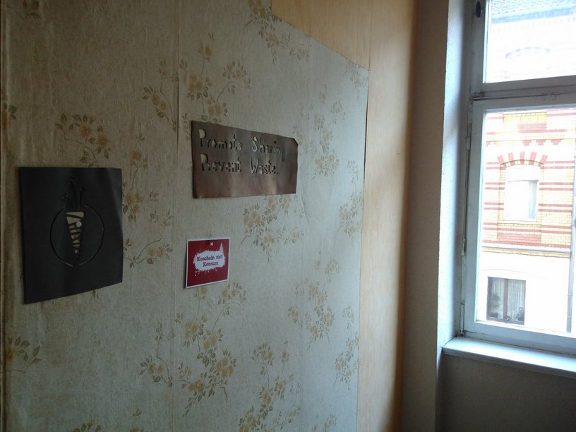
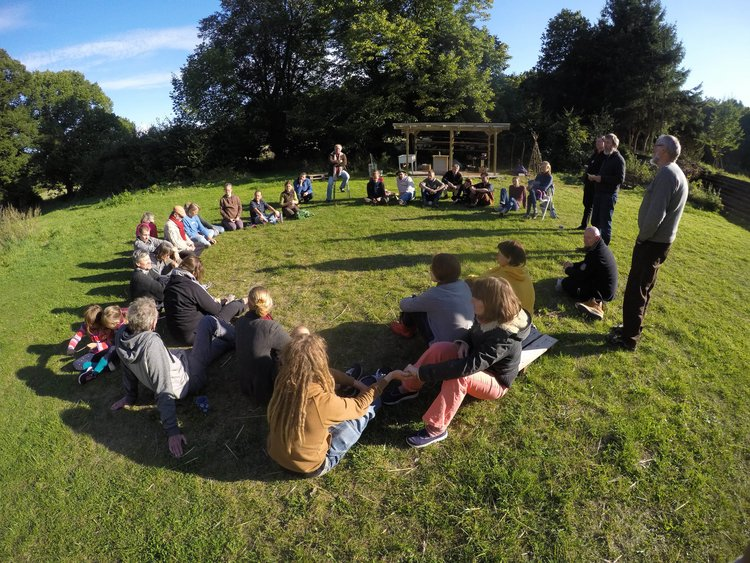

**The yunity heartbeat** - news from the world of sharing, fresh every two weeks.

## Foodsaving Worldwide
The [Hackweek](../2017-09-17) is over and we are back to working together in a remote way. But we're still feeling the momentum brought to us through the time of being closely together and we achieved quite much:
* We have a prototype for a static info page that is to be reachable via foodsaving.world
* Our hosted instance of the Karrot software will move to app.foodsaving.world (_to be decided_) to make it more clear that foodsaving worldwide and Karrot are _not_ the same
* Karrot-frontend gets steadily rewritten and foodsharing.de development sees a surge of activity. Read more about these two topics down below:

===

## Karrot

After the end of the Hackweek, progress on the new VueJS-based frontend slowed down. Still, Nick, Lars and Tilmann have been working on the [_Megalist_](https://github.com/yunity/karrot-frontend/issues/619) tasks. Tests were added, the state management was improved, group conversations were enabled and the pick-up list got a nice fancy design.

Backend-wise, Ines and Marie have been improving the pick-up feedback model. They also wrote a nice introductory report for new backend developers, to be published soon in [our blog](blog.foodsaving.world).

The Rails Girls Summer of Code (RGSoC) is now finished. A great __thank you__ to Ines and Marie for their motivated work! We hope that they stay close to the foodsaving worldwide project. Also, we will probably apply again at the next RGSoC(-like) event.

_by Tilmann_

## Foodsharing.de development
In a [new blog post](https://devblog.foodsharing.de/2017/09/19/a-plan.html) Nick explains in more detail how he imagines the foodsharing.de development to work from now on. Kristijan and Peter had a long call with Nick, in which he empowered them to become more active and just recently another new contributor showed up and said the magic words the main devs always love to hear in context of a feature request: "I need a feature and I need it desperately enough to code it myself, can anyone give me dev access to Gitlab?"

Also the repo becomes more and more tidy: pull requests get accepted and old branches are deleted. Progress is tangible and Nick thinks of a new release accompanied by yet another blog post. Stay tuned!

## Kanthaus Wurzen
With Bodhi we have our second volunteer at Kanthaus!  
Since this seems to become a more frequent event, Doug is already thinking of somehow automating or optimizing the task of knowing when somebody becomes eligible for volunteerism. He put an [issue](https://gitlab.com/kanthaus/kanthaus-private/issues/10) in the private Kanthaus repo on Gitlab - the space, where we now collect and manage the tasks of the house. This system may seem a little complicated for the less techie ones, but all the technophiles love it. We just need to tidy it up a little and get more clarity about what counts as private and what should be public. When that is done, the public repo will automatically be converted to [kanthaus.online](https://kanthaus.online) - our homepage - so that transparency and readability for everyone will be guaranteed!

## Ukuvota
After the Hackweek ended, development on Ukuvota also slowed down. Still, there are some new features and ideas:
- translations to German are 90% complete
- integrated discussion pads for the proposal phase are in progress
- there are new plans to integrate an append only database to improve security

## WuppDays Dargeluetz Planning
We held a [poll](https://poll.disroot.org/IGx3pHz1cN3hSWs8) to determine the best time for the upcoming WuppDays in Dargeluetz and the results showed a clear bias towards the last half of November, specifically the last week. Plannings will go on with this timeframe in mind.

 _by Janina_

## Harzgerode
Stuff is happening again! The three ["getting to know each other" meetings](https://www.gemeinschaftsstifter.info/gemeinschafts-initialtreffen/) are over and the community is being founded.

There was a very concrete and motivating meeing about who "could" move in right away and under what basic conditions. It seemed to be sort-of-consensus that things like paying rent (and money in general) and using spaces would be solved solidarily. The group that met generates enough monthly and one-time funding to pay for the upkeep of the place and the heating system (which apparently is already ordered). A possible scenario for the yunity-ish people here could be: make one or two very improvised clay ovens in the Inspektorenhaus before winter, sleep there and have a community room that can be heated with wood (at least a bit ;)  And use community rooms in Ost for working and hanging out, spending time with the other people of the community, etc. In the long term (from next spring on) concentrate on making the Oberarzthaus nice and usable, do some immediate things now to prevent further decay.

Other yunity-ish people interested in Harzgerode in the next weeks/months/years?: Wolfi, Anna (Oldenburg), Steffen, Lise

_by Bodhi_
