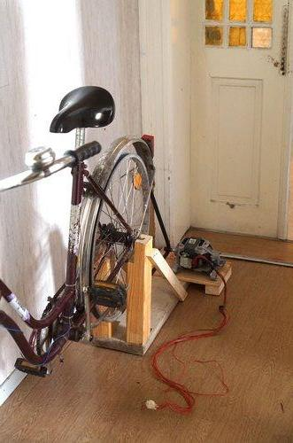

**The yunity heartbeat** - news from the world of sharing, fresh every two weeks.

## Foodsaving Worldwide
We recently received quite some mails again!  
Christopher wants to carry the foodsaving and foodsharing movement to Canada, Patrycja to Hamar in Norway and Alice to Besançon in France. On that note, here's some updates about already existing projects:
- **Copenhagen** is going strong as always. They just recently announced their very first community kitchen event. Visit their [facebook page](https://www.facebook.com/FoodsharingCopenhagen) for more details.
- **Taiwan** received the g0v grant and now sees a surge of activity: They got a [new website](http://foodsharing.tw/) and are eager to help improve Karrot to a point they feel comfortable using it. The plan is to have a nice digital infrastructure to be able to grow bigger. As of now there are daily pick-ups at a bakery and two food-share points.
- **Warsaw** already is home of 8 (!) food-share points! A sustainability blogger recently created a [pretty map](http://www.nanowosmieci.pl/wp-content/uploads/2017/10/jad%C5%82odzielnie-warszawa_ulotka.jpg) of all the Warsovian FSPs - or jadłodzielni as they're called in Polish. Their [facebook group](https://www.facebook.com/FoodsharingWarszawa/) reached 5000 likes just some days ago and they regularly appear in Polish media. There are more foodsharing projects in different Polish cities and if anyone can provide more info about those, I'd be happy to hear it! :)
- **Gothenburg** has 4 food-share points and cooperates with multiple stores and restaurants. On top of that they are very active in promoting sharing in general and will host a series of hackathons next year to revive the project to build a multisharing platform. Visit their [website](http://solikyl.se/about/) for more information on Solikyl and [#multisharing](https://yunity.slack.com/messages/C5FFR125V/) on [Slack](https://slackin.yunity.org) if you're interested in the idea of sharing everything.
- **Maastricht** had a summer break, but now the semester started again and so does foodsharing! They do pick-ups from a small supermarket and a café and distribute the food via their room in the university. They also participated in an event for th Dutch Earth Week recently. Check out their [facebook page](https://www.facebook.com/FoodSharingMaastricht/) for more details.
- **Bilbao** also took a break over summer and is now restarting its foodsaving activities. Another foodsharing presentation was held at a festival of circular economy to raise awareness for the project. There are pick-ups at an organic supermarket and they had a cooking event, where saved food was prepared using solar cookers from Engineers withour borders. Read more about what they are up to on their [facebook page](https://www.facebook.com/groups/1853289058224368/).
- **Wageningen** has cooperations with various small shops, restaurants and market stands and distributes the saved food through a food-share point at [THUIS](http://thuiswageningen.nl/), as well as via their [facebook group](https://www.facebook.com/groups/657511510960713/)
- **Hongkong** is still a little bit unknown to us, so I'm glad that Robert will stop by there and meet up with some local foodsavers to gather intel on what's actually going on there. :)
- **Edinburgh** is similarly distant - even though they seem to have a nicely successful project running over there. They have a well-running [facebook group](https://www.facebook.com/groups/foodsharingedinburgh/), where peer-to-peer foodsharing is happening, they have a nicely informative [website](www.foodsharing.scot/) and apparently they also run events now to tackle food waste in households by teaching people how to cook in a fun and sustainable way. Very cool! At some point I'll definitely visit them to see for myself...^^

(there are still some missing and it's already so much... maybe I shouldn't write it like that after all..? Hm...)

## Karrot

## Foodsharing.de development

## Ukuvota
There now is a dedicated [Gitter chat](https://gitter.im/ukuvota/Lobby) for Ukuvota, where you can request features, give feedback and talk to other users of our nice score voting app. Since Wolfi fears to run out of tasks he already went fishing for issues and collects more and more of those in [Gitlab](https://gitlab.com/yunity/ukuvota/issues).

New features already integrated are:
- Proposals are now editable.
- Links are automatically rendered clickable.
- The negative score weighting can be adapted for every vote.
- There is a QR code provided for the sharable link to a vote.
- An extensive [manual](https://staging.ukuvota.world/#/manual) with lots of background information on voting systems got included directly on the page.

## Kanthaus
Max and Mona both became volunteers and plan on staying for a while! :D  
We had a structural engineer over, who provided tons of useful info on what there is still to do on the very substance of the buildings. Doug continued to think about refining the process for residents to change status in the house and made an [informative flow chart](https://user-images.githubusercontent.com/17573771/31617483-a2272784-b28f-11e7-9ed6-e1731eac503e.png) (It already includes the idea of a prescribed reapplication of members after six months, although this was not formally accepted yet). Mona started the topic of creating a more clear code of conduct, that will allow us to actively prevent people from behaving in a way that is racist, sexist, homophobic and generally anti-egalitarian. And since we still don't have any other power supply in the buildings than some old solar panels, I'm especially excited to present to you our new and fancy **bike-driven electricity generator**:

As Matthias describes it, it works as follows:
> A good operating point is ~40-55W charging a 12 V lead acid battery system. Putting in a bit less the mechanical power, we were also able to achieve 70W powering a 250W light bulb (0,7A @ 100V) - meaning that the motor is turning a bit too fast to work in maximum efficiency at 12V.

But of course, he's still working on improving it! ;)
