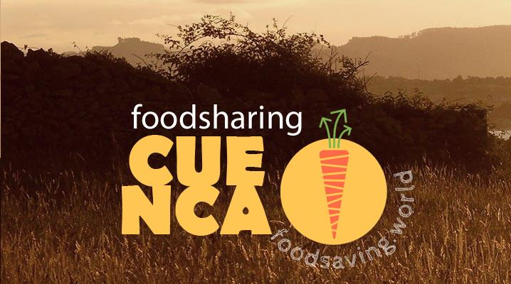
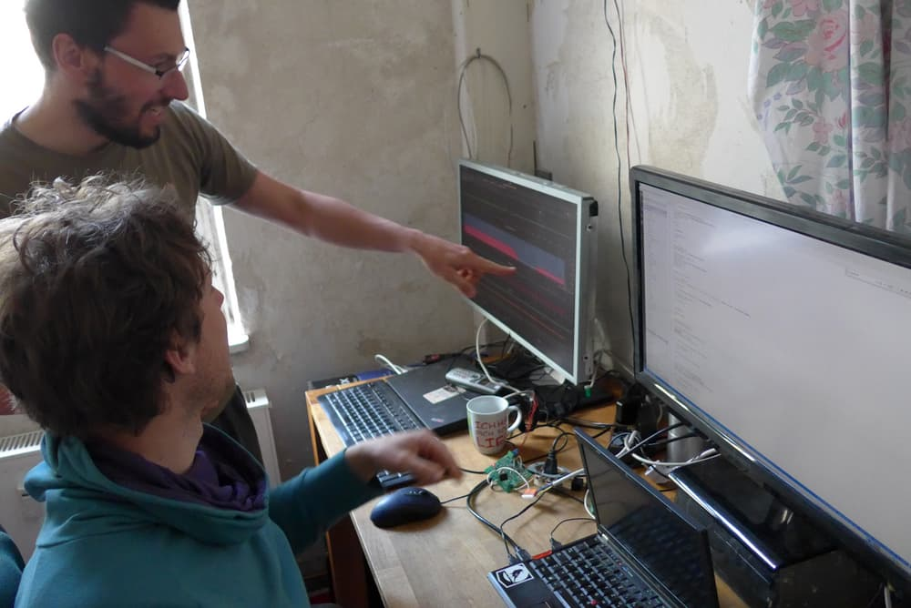
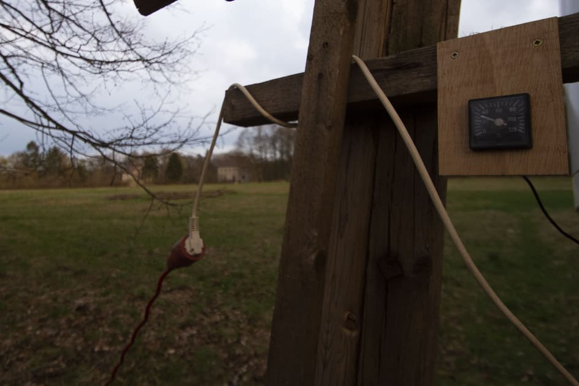

**The yunity heartbeat** - news from the world of sharing, fresh every two weeks.

## [Foodsaving Worldwide](https://foodsaving,world)
- The [World Disco Soup Day 2018](https://www.slowfood.com/what-we-do/international-events/world-disco-soup-day/) is coming up! In less than two weeks, on April 28 [Slow Food Youth Network](https://www.facebook.com/slowfoodyouthnetwork/)'s 2nd global event will take place - so there's still time to take part! It's easy, really, and an amazing way to reach out to people about food waste, while having a lot of fun at the same time! Just [join the organizer's group in facebook](https://www.facebook.com/groups/339657459716739/) or directly [follow the instructions](https://docs.google.com/document/d/1ejcoJ4ccw-PhqzMNuPi3kQ-VpvO2_yK6450UxSp9pq4/edit) and join in a distributed but global anti food waste party!

_Be part of it!_

- [Foodsharing Ecuador](https://www.facebook.com/foodsaving.world.Ecuador/) becomes the pioneer foodsaving project in Latin America! It already spread from [the capital](https://www.facebook.com/groups/foodsharing.ecuador/) to a second city - [Cuenca](https://www.facebook.com/groups/foodsharing.cuenca/) - and the foodsavers of Quito become the go-to address for other potential Foodsavers from e.g. Peru and Argentina as well!

_Logo of the new foodsaving group in Cuenca_

- [Foodsharing i Östersund](https://www.facebook.com/groups/194858781249133/) is getting the ball rolling! They hold events all the time, have regular cooperations with stores and a Food-Share Point. They also already [contributed Swedish documents](https://yunity.atlassian.net/wiki/spaces/FSINT/pages/222855174/Example+letter+to+a+store+EN+SE) to our knowledge library and are in frequent contact with us and other Swedish foodsavers. Way to go! :D

_by Janina_

## [Kanthaus](https://kanthaus.online)
A lot of technological/sustainable achievements have been made in the past weeks.
The roof of the sheds across the garden is now full of crappy GS-50 PV-panels that were still lying around at the station in Bad Dürrenberg.

_Bodhi connects the solar panels._

This gives us about 1.3 kW at ideal conditions and usually still more then 100 W at crappy conditions (cloudy, no direct sun..). Since we have a basic load of about 200-500 W during the day and 50-100 W at night (depending on the amount of people at Kanthaus and other factors), we have will have quite some excess energy a lot of times. We cannot put this energy into the grid yet, so we had the idea to “store” the excess energy in the form of hot water. For this purpose we installed one of the old 80 L boilers that were still in K22 in the bath- and shower room in K20-2-1. We can now have hot showers without paying for energy, yay!

_A huge boiler of water heated by the sun!_

This is still a very improvised installation. Within the next weeks Matthias and Tilmann will build a system (using [the house-bus already in place](https://handbook.kanthaus.online/housebus.html)) to control the energy flow according to the current weather conditions and energy consumption. When that's done we will probably also install more boilers in the other floors of K20. We will then have hot water in the ground floor (for food washing and washing machine) and the first floor (for dish washing and cooking)!

_Matthias and Tilmann working in the [Silent Office](https://handbook.kanthaus.online/silentoffice.html)_

_by Bodhi_

## [Karrot](https://karrot.world)

We reached Github [issue number 1000](https://github.com/yunity/karrot-frontend/pull/1000)! Actually, it's a pull request... but it does not matter. It just shows that a project with a significant number of contributors needs a lot of synchronization and organization.

After some weeks without new release to [karrot.world](https://karrot.world), a new one is approaching and should be ready within the next days. It will include:

- the new authentication system for sensitive actions (you can delete your account now!) by @mr-kojo
- upgrade to Font Awesome 5 by @ananya-agrawal
- upgrade to Quasar 0.15 by @tiltec
- pickup notification bugfix by @nicksellen

[@ananya-agrawal](https://medium.com/@ananyaagrawal125/how-i-started-contributing-for-rgsoc-638c01738329) wrote up a nice article about her experience contributing to Karrot as part of RGSoC 2018. We are happy about her motivation!

> The reason why I decided to contribute to karrot was its idea itself. The project is meant to provide web support to food saving groups worldwide. I was really interested to witness how technology can help solve a very basic problem. Moreover, the project is based on Python thus perfectly suits my and Neha’s previous experience and interest.

Two students from the University of Michigan got the assignment to contribute to an open-source project and chose Karrot. They have been working on _editing of conversation messages_ and _showing a message to users of unsupported browsers_. We are happy that we got their attention. Maybe they even continue contributing after their assignment is done, who knows...

_by Tilmann_

## Haus X

Spring has arrived at Harzgerode. Some weeks ago Bodhi, Lise, Josi and Steffen met and discussed some basic conditions of the project regarding the rest of the Harzgerode community. Since then, Josi and Steffen started first steps to make the house habitable and to build up an temporary kitchen which should be ready to use the upcoming weekend, when some more people will join the four for further planning and working. By the way, the solar shower is back in service and enhanced wit the PV panels on the compost toilet for faster heating up.

_You can shower at 30°C already!_

_by Steffen_

## About the heartbeat.
The heartbeat is a fortnightly summary of what happens in yunity. It is meant to give an overview over our currents actions and topics.

### How to contribute?
Talk to us in [#heartbeat](https://yunity.slack.com/messages/heartbeat/) on [Slack](https://slackin.yunity.org) if you want to add content, change the layout or any other heartbeat related issues and ideas! We are also happy about any kind of feedback! ^_^
