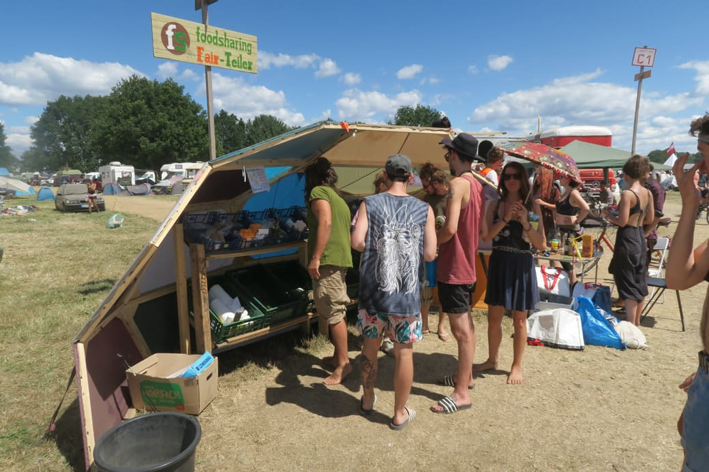

**The yunity heartbeat** - news from the world of sharing, fresh every two weeks.

## [foodsharing on festivals](https://foodsaving.today/en/blog/2017/05/14/foodsharingde-festival-call)

Around 19 festivals had an official foodsharing booth this year. Thanks to dozens of motivated foodsavers in and outside the experienced working group 'festival coordination' we were able to establish 8 new cooperations! E.g. after months of talks with the organizers, the [Fusion festival](http://www.fusion-festival.de/en/2018/home) agreed to hosting us, and we sent a group of 20 foodsavers there, who built and maintained 5 food-share points designed by Silvan.

  
_One of Silvan's food-share points in action_

Apart from the big commercial festivals organized by [FKP Scorpio](https://www.fkpscorpio.com/en/festivals/) (like Hurricane, Southside and Highfield) we also attended the lovely [folk festival in Rudolstadt](https://rudolstadt-festival.de/en/start.html), the brass-only [Brass Wies'n](https://www.brasswiesn.de/index.php) near Munich and the [OpenFlair](https://www.open-flair.de) with much less visitors. Our most spontaneous attendance was definitely at the [Artlake](http://artlake-festival.de/), for which we only had 2 days of preparation before 9 foodsavers realized a well-visited info booth and food-share point, numerous workshops (like naked swimming, AcroYoghurt and preserving food) and a collaborative brunch.

  
_Lise and Malte doing some last-minute organizing at Artlake_

To discuss the experiences of this festival season, share difficulties and success, distribute responsibilities for next year's season and drink some saved beers, the working group 'foodsharing on festivals' will meet over a weekend in October. After that we will go into the well-deserved winter break and tackle tasks like sorting material, writing reports, maintaining communication with the festival organizers and already looking out for people who can imagine more interesting things than staying home and watering the plants on the balcony.

_by Lise_

## [Kanthaus](https://kanthaus.online)

The year at Kanthaus is divided into 4 seasons: Winter (December to February), Spring (March to May), Summer (June to August) and Autumn (September to November).  
As you can see summer just ended, and so did our summer roadmap. Since summer is a pretty busy time, with lots of people going to festivals and events all over Germany and beyond, we did not take on too many tasks to begin with [and made progress with everything we started](https://gitlab.com/kanthaus/kanthaus-public/milestones/7). The autumn planning will take place on Tuesday and we already had a very fruitful room planning meeting which will serve as a good base to build on. Many changes are still to come!

  
_Janina and Lise had a lot of fun sorting the communal closet_

On the more social and/or philosophical side, we got two more blog posts, this time by two of our founding members: Laurina writes about [the balance between doing and being](https://kanthaus.online/de/blog/2018-08-16_balance-doing-being) and Matthias about how for him it works best to [be through doing](https://kanthaus.online/blog/2018-08-31_being-through-doing).

_by Janina_

## [Karrot](https://karrot.world)

_A personal review from Tilmann_

After months of work, group applications, replies to wall messages, the conversation overview page and the new sidenav were finally released. We got [feedback from Karolina](https://community.foodsaving.world/t/new-user-levels-proposed-for-karrot-newcomers-and-editors/95/4) on community.foodsaving.world about the planned trust system feature. I continued working on it and hope to release it into production this September.

I discovered [a bug in the channels_redis library](https://github.com/django/channels_redis/issues/125) that caused karrot.world having hundreds of redis connections open, until the server didn't allow to open more. Before I could track it down to channels_redis, I spent hours trying out different combinations of settings. My final contribution to this problem is this [minimal reproduction](https://github.com/tiltec/channels-redis-sync-repro/) that should make it easier for channels_redis maintainers to fix the problem.

It was a disaster trying to upgrade [Cordova](https://cordova.apache.org/) (a tool to write native smartphone apps in JavaScript) from version 6 to 7. Almost every Cordova plugin we use isn't maintained anymore and I kept hunting for forks that are compatible with Cordova 7. In the end, I asked myself why I'm even upgrading when nobody else wants to. I guess there are not many advantages going from version 6 to 7, so I stopped and reverted. Another lesson learned: don't just upgrade out of habit, it either needs to be painless or there should be great advantage.

I consider this summer a success for Karrot and expect more quiet times in autumn and winter, at least feature-wise. We still have [some refactoring to do](https://github.com/yunity/karrot-frontend/issues/1066) to have a nice codebase again...
