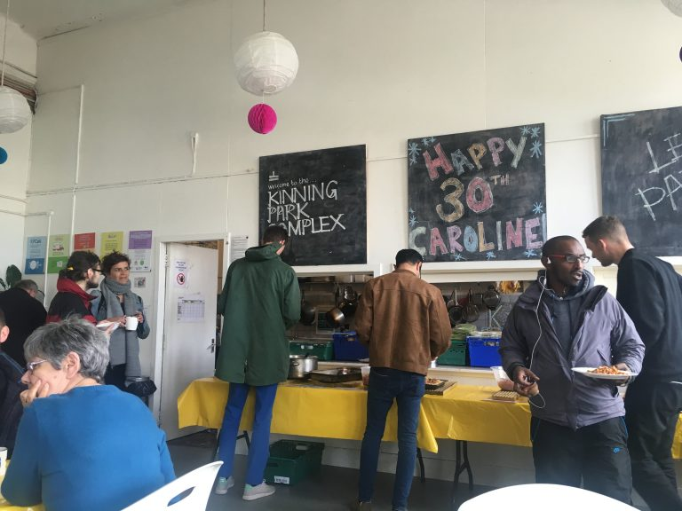
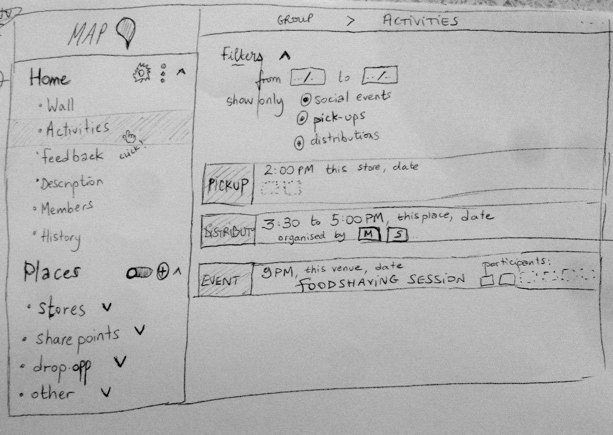

**The yunity heartbeat** - news from the world of sharing, fresh every two weeks.

## [Kanthaus](https://kanthaus.online)

The past two weeks at Kanthaus have been more quite, with few people and lots of construction things going on. The heating-connection of K22 is commencing with just a few things left to completion, indoor compost toilets are being prepared and many small thing are happening.

Since a few days Kanthaus is hosting the foodsharing co-working-week with about 6 participants wupping for foodsharing. Since even more people are arriving begining of next week, the quiet times are soon to be over!

_copper-soldering with a very sophisticated pressure control-system for the gas burner - don’t try this at home!_

_by Bodhi_

## Harzgerode / Haus X

After some long radio silence from Harzgerode, here's the comeback.

The main project changed its direction to more solidarity and way less conventional view on money. Since then Haus X is just one flat (WG) inside the project instead of the formerly planned subproject within the conventional ecovillage.

We have been busy getting everything legal (Bauanträge), did a lot of community building (with success. By now we are a fix group of eight inhabitants). Even the financing of the porperty is taking shape. 

Until now it was unsure if the project can continue next year. This time of worries is now over.
We even have a new homepage [freiefeldlage.de](http://freiefeldlage.de).

Now we are preparing for the upcoming winter and could use some help. There's a building-week from 01 to 07. of October to make Haus X ready for the cold.

_by Steffen_

## [foodsaving worldwide](https://foodsaving.world)

I moved to Glasgow and have been trying to get in contact with as many foodsharing initiatives here as possible. There is [Foodsharing Glasgow](https://foodsharing.scot), but I didn't get any email replies, and when I visited the address whatever was happening there before has long since stopped. I went to the weekly [unity world cafe](https://unityinthecommunityglasgow.wordpress.com/unity-world-cafe-food-bank/) at the [Glasgow Autonomous Space](http://glasgowautonomous.weebly.com/) but the building was closed and no reply to my email.

I visited the [KPCafe](http://www.kinningparkcomplex.org/kpcafe/) project at the Kinning Park Complex and had more success! I'll be doing some general volunteering there. They get food from [FareShare](https://fareshare.org.uk/) and a local Tesco, cook it up into a tasty meal, and serve it on a pay as you feel basis.

_The food counter at the KPCafe_

I kept trying though! I went to the Glasgow uni [sustainability freshers festival](https://www.facebook.com/events/200331514160123/) on the tip that someone would be there interested in foodsharing. It seems foodsharing Glasgow has been active on campus more recently distributing excess bread, but perhaps the activity follows the university semesters closely. Taïs is in contact with the [GUEST](https://www.gla.ac.uk/myglasgow/sustainability/guest/) team who are involved with that.

I also met a very enthusiasic guy from a foodsaving group based at Strathclyde University (also in Glasgow). They have about 4 stores they pickup from, they then bring the food back to the campus to share it further. He struggles to get enough reliable people to do pickups. I showed him Karrot on my phone and before I even got home he was SMSing me to ask how to create a group, pickups, etc. I've also signed up to do a pickup myself! (Despite my involvment in these foodsaving software projects, I've never actually done a pickup...).

It got me thinking about to connect food saving projects across the city (seems quite limited if the groups are just silo'd to the universities). Not many conclusions yet :)

I also went over to Edinburgh to see if foodsharing Edinburgh would have a use for Karrot, they said:

> It was great to meet you too! Thanks for giving me a little intro to all things karrot :) I'd be really interested in learning more and exploring options for collaboration, but as things are super busy right now with inducting volunteers and getting new projects off the ground, I will have to put this on the back burner a little. I will speak to my colleagues and get back to you soon.

So, seems positive, but a bit longer to see if it works out.

Me and Lise replied to more enthusiasic people wanting to start food saving groups in São Paulo, Brazil and in Turkey, lets hope they find some energy to get started.

_by Nick_

## [foodsharing.de](https://foodsharing.de)

It's long been discussed to get a proper app for foodsharing, and some good steps towards that were recently made. A recent newcomer, Diego, created a skeleton android application written in Kotlin. I reworked a few bits and added a couple of extra API calls then moved it into our GitLab organization - you can find it at [gitlab.com/foodsharing-dev/foodsharing-android-kotlin](https://gitlab.com/foodsharing-dev/foodsharing-android-kotlin). It's still a proof of concept really, but a nice step forwards.

One of our newer contributors, Theo, also started exploring a mobile app for iOS and created an experimental client. You can find the project at [github.com/theolampert/foodsharing-ios](https://github.com/theolampert/foodsharing-ios).

Me and Peter discussed switching to use npm instead of yarn - mostly to take advantage of the fact that the [nodesecurity](https://nodesecurity.io/) project is now part of npm and included via the [npm audit](https://docs.npmjs.com/cli/audit) command. But also I feel that the bugs that were in the earlier v5 releases (with the new `package-lock.json`) are probably fixed by now.

I started working on adding [persistent cookie support](https://gitlab.com/foodsharing-dev/foodsharing/merge_requests/543) (so you don't have to login so frequently). I thought it would be a 2 character change, but ran into many difficulties - EU cookie law means we would have to get consent (where we don't for the existing session cookies), which could be in the form a of "remember me" checkbox (so now I have a UI design task), also the Symfony dependency injection got more complicated as I wanted to avoid setting cookies unless you are actually logged in. Such is the life of a software developer!

There were discussions regarding [bugs when using in FireFox ESR](https://gitlab.com/foodsharing-dev/foodsharing/issues/306), [fixing the bell notifications + adding push](https://gitlab.com/foodsharing-dev/foodsharing/issues/336), an [idea to expire food baskets after 4 days](https://gitlab.com/foodsharing-dev/foodsharing/issues/340), [feedback from Munich](https://gitlab.com/foodsharing-dev/foodsharing/issues/204) about the proposal to remove status information from user name fields, and more!

_by Nick_

## [Karrot](https://karrot.world)

Since Janina and Tilmann left for their bike trip activity has quietened down somewhat, but not to zero!

Despite this, Tilmann managed to start work on [adding proper notifications](https://github.com/yunity/karrot-frontend/pull/1099) (a bit like the "bell" in foodsharing.de).

Me and Taïs [started thinking about](https://github.com/yunity/karrot-frontend/issues/354#issuecomment-421329381) how to implement more types of locations (fair share points, drop off points, etc.).

_Taïs did a bit of wireframing_

Taïs also translated the rest of the frontend into French - and got her instant karma as someone from the uni came and gave us 10 or so packs of sandwiches that they needed to get rid of :) ... we now need to work out how to put the translations into the app (so far Tilmann has always done it).

I [fixed a bug](https://github.com/yunity/karrot-frontend/issues/1097) that was making it difficult to manage the group application chat, there was [a bit of dreaming](https://community.foodsaving.world/t/occupy-both-spots-feature-suggestion/111) about whether it should be possible to take _all_ the slots for a pickup, some [more thoughts](https://github.com/yunity/karrot-frontend/issues/1096) about how to improve email reply parsing, and probably more!

_by Nick_

## About the heartbeat.
The heartbeat is a fortnightly summary of what happens in yunity. It is meant to give an overview over our currents actions and topics.

### How to contribute?
Talk to us in [#heartbeat](https://yunity.slack.com/messages/heartbeat/) on [Slack](https://slackin.yunity.org) if you want to add content, change the layout or any other heartbeat related issues and ideas! We are also happy about any kind of feedback! ^\_^
