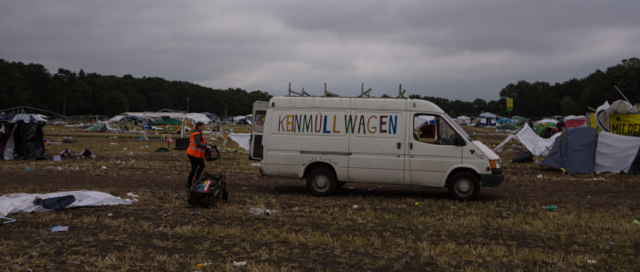

**The yunity heartbeat** - news from the world of sharing, fresh every two weeks.

## [Kanthaus](https://kanthaus.online)
Hey there, my name is Matthias and I took over the responsibility and honour to fill in the Kanthaus part in the 45ths week heartbeat.

I consider Kanthaus my home, place to live, work, be, learn, chill.
I was part of the very first group that came to Kanthaus and have also driven some of the things going on or being there.

I am proud to present you the recent addition to one of the technical things we have at Kanthaus:
The [HausBus](https://github.com/NerdyProjects/HouseBusNode).

Over the last weeks I prepared using the initial driver for the first [PCB](https://en.wikipedia.org/wiki/Printed_circuit_board) layout: Replacing the electronics of a Viessmann Trimatik-MC heating system controller.

So since a few days now, we have heating (again; as we took quite some time to finally connect both houses together and it got later and later; luckily, the outside temperature is with us).
And our heating controller is even open source [Link to source file](https://github.com/NerdyProjects/HouseBusNode/blob/master/sw/nodes/viessmann_trimatik.c)!

But the controller is shit, still, lacking important functionality like supporting day/night mode.

Still, the actual regulation is implemented using the same calculations as in the original controller.

I just noticed that I am going a bit far in... So let me finish this part with showing you a little graph:

 

So in the graph you see the time where the heating system gets turned on in the morning.

The main purpose of the heating system controller is gathering data to possibly
  * Optimize how we currently heat
    * Match heating requirement with actual heating
    * Fixing algorithmic problems like low-load overshoots
  * Gather data for a future heating system exchange
    * Find out actually required power
    * Find out about needed flow temperatures
  * make it more visible to people how heating actually works

I should really write a blog post instead...

A quick wrapup of what we are up to as well:
  * We do standup meetings at 09.00 in the morning quite regularly.
  * Tilmann started doing excercises using the [Feeel](https://f-droid.org/en/packages/com.enjoyingfoss.feeel/) app. Somehow, this is now a daily habbit for a lot of us.
  * We gathed the first experience with lime paint and have a mostly nicely white living room wall now :-)
  * Lots of more lights got installed around the houses
  * The workshop is nearly moved into a bigger room in K22, there will be a separate electronics workshop next to it soon
  * We have two peach trees in our garden now
  * There will be a MOVE organisation meeting next weekend
  * ... we are having a jolly good time :-)

_by Matthias_

## KeinMüllWagen
As I was writing in this heartbeat anyway, I allowed myself to even add a new section...

Have you heard of the KeinMüllWagen?

 

It is a car! And the mess around it is normal for the activity it was initially bought for: Rescuing and transporting stuff.

Recently I read more and more about the car, how to repair it, how it works etc. and I noticed, that I really like working with this car.

The project I am currently working on is making it work on [LPG](https://en.wikipedia.org/wiki/Liquefied_petroleum_gas) instead of petrol.
This is actually quite easy and cheap and even legally allowed to do it yourself, you just need to have it checked by the TÜV or Dekra afterwards.

Why?
  * Economic reasons: LPG is less then half the price of petrol (but the car needs 10..15% more of it)
  * Ecologic reasons: A motor running on gas emits much less of all bad things in the exhaust
  * Fun: I like researching, buying and putting together stuff :-)
  * More fun: I get the possibility to reverse engineer the LPG [ECU](https://en.wikipedia.org/wiki/Electronic_control_unit). More precisely, the communication software with the computer to have it Open source, linux enabled and all the information needed to add a display with more information into the car (or do other things with it).

Stay tuned for a blog post about it...

## [Karrot](https://karrot.world)

## [Foodsaving Worldwide](https://foodsaving.world)
There is a new article on foodsaving.today about the foodsharing groups in Warsaw, Łódź and Wrocław. The [community forum](https://community.foodsaving,world) sees more and more activity, like [this discussion on Swedish networking](https://community.foodsaving.world/t/cooperation-to-kickstart-foodsaving-in-some-swedish-cities/128) and [this one about a potential Karrot/FSWW co-op](https://community.foodsaving.world/t/a-karrot-co-op/124/).

And according to a post in the [foodsaving worldwide facebook group](https://www.facebook.com/groups/foodsaving.worldwide/) there are people planning some projects in Norway in November. Fittingly, a committed foodsaver from Darmstadt, Germany, has recently moved to the Scandinavian country and is ready to help build an organized movement of foodsavers. Let's see where this leads! :)

 
_The facebook post_

_by Janina_

## [foodsharing.de](https://foodsharing.de)-dev
Since the last release in August there have been 26 additions to the changelog's 'unreleased' section. And what's most exciting about is that next to 12 bug fixes, 2 bits of refactoring and 2 dev things, we also have 10 actual features! To experience them already, you can go to [foodsharing beta](https://beta.foodsharing.de/).

All these changes are possible because there is a nice and productive atmosphere in the new (and still growing!) developer group of foodsharing.de. Take this screenshot of a conversation last Thursday and get a taste of what I mean:

 
_Language and meaning is a frequent source of fun in the international team_

_by Janina_
