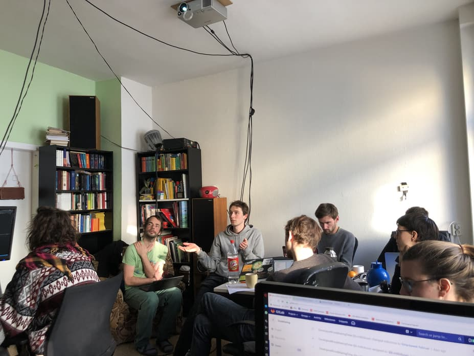
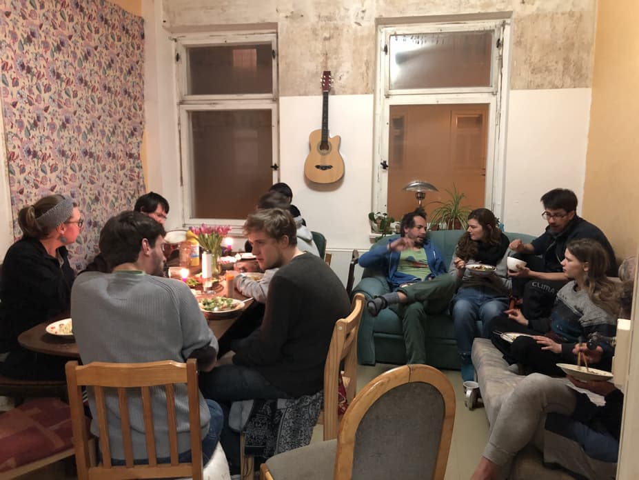
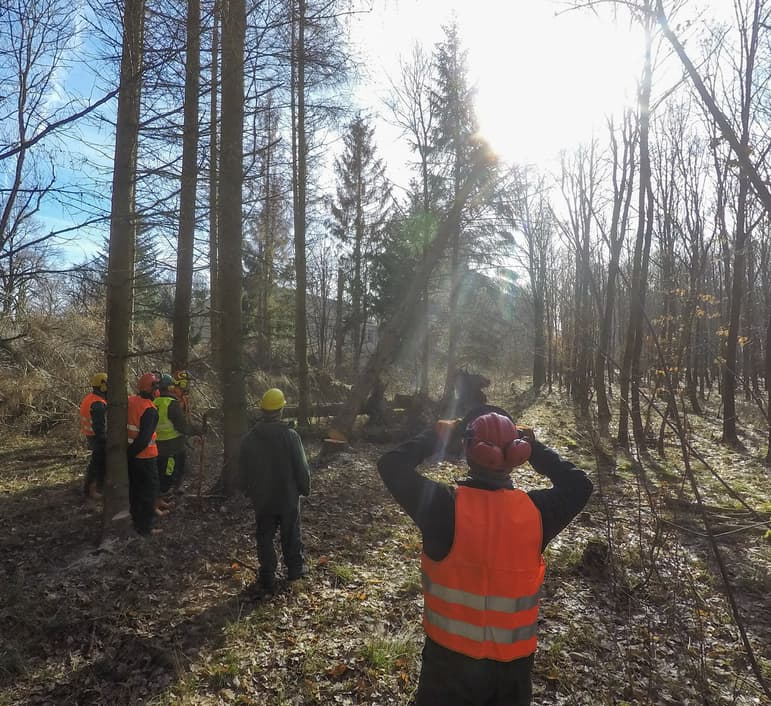

**The yunity heartbeat** - news from the world of sharing, fresh every two weeks.

## [foodsharing.de](https://foodsharing.de) dev

After already two foodsharing.de hackweeks in the past the tradition goes on with another week full of community hacking for the foodsharing plattform at Kanthaus. About 9 people including the regular people (Matthias, Chandi, Nick and Kristijan) as well as new visitors and residents at Kanthaus (Lars, Jo, Janina, Jano and Felix) tackled a wide range of issues.

The goal of open sourcing the platform still is central and this time we succeeded! Everyone around the world can now even more easily join in the development, [check out our now fully public repository](https://gitlab.com/foodsharing-dev/foodsharing)! We celebrated with a short but enthusiastic party on Thursday night.

 
_Nick walking us through the high level structure of the code_

The fully accessible code base has received more documentation - although still with massive room for improvement... ;) We replaced old javascript spaghetti code with new fancy vuejs components in several locations, most notably on the dashboard.
Probably the most noticed new feature will be push notifications as soon as they make their way onto the website together with the release of the first version of our Android app.

But coding was not the only thing we spent our time on over the past week, we also took time to share community experience with everyone at Kanthaus. We have had a good time and looking forward to upcoming hackweeks (maybe in Zurich the next time?) and Kanthaus visits.

_by Felix_

## [Kanthaus](https://kanthaus.online)

Kanthaus was all about foodsharing over the past two weeks. Already when it was technically still the last week of the month of calm, we started preparing the upcoming board meeting and hackweek. Over the weekend February 15 to 16 we had 7 board members and consultants meeting at Kanthaus. It was the second annual board meeting that was held in Wurzen and we're happy that some board members already said that they'd like to make it a regular thing. :)

 
_The people participating in the 2019 foodsharing board meeting_

On that same weekend also the coders who wanted to join for the foodsharing hackweek slowly arrived one after the other. The following week we had almost 17 people in the house on average and the former piano room was transformed into a hackbase by removing the piano and adding a lot of desks, power plugs and screens.

 
_The dining room was at its limits once again..._

With all those people around our newly adopted concept of WuppHours - a time on Wednesday mornings when everybody joins forces to do some manual labor - lead to great steps forward in our construction works plans: The scaffolding we bought to redo the roofs, walls and windows was built up three levels already, almost all old plaster got removed from the K22 basement that is meant to become the new food storage, a sink got unblocked and a car-load full of foam was moved to the attic for future use.

 
_Our brand new 2nd hand scaffolding!_

_by Janina_

## [Foodsaving Worldwide](https://foodsaving.world)

There is a new article about [foodsharing from an Armenian perspective](https://foodsaving.today/blog/2019/02/18/armenian_inquiries) on [foodsaving.today](https://foodsaving.today). Author Amalie Khachatryan explores if and how the German model of foodsaving could work in her home town and was happy for us to republish her work in a translated version. Thanks a lot!

_by Janina_

## [Harzgerode](http://freiefeldlage.de/)

At the time of the last heartbeat this was the image of Harzgerode: frosty temperatures, footsteps in the snow and stormy nights during which the wind howls through the many cracks of Haus X. Today the mood is completely different. A week ago spring woke the area from hibernation with a kiss and since then sun is shining everyday. With it comes motivation to work outdoors in a t-shirt.

So last weekend we had our chainsaw course in the best possible weather. We learned how to cut trees the safe and professional way, how to repair damage done by storm and how to maintain the chainsaw itself. Now we're all set for the next winter, since we have tons of fire wood on the area of the Heilstätte which now can be cut into fitting pieces all year long.

 
_Professional tree cutting in the Heilstätte forest_

The only thing keeping us from it is the neverending office work... but luckily it is carried by more and more shoulders. Just recently two newcomers joined the group permanently to help build up the community in Harzgerode. And to also enjoy nice, relaxing times together, we had fun with a sauna caravan, campfire and BBQ on the terrasse last week.

 
_The leaves are still missing, but the bbq is hot already!_

_by Lise_

## About the heartbeat.
The heartbeat is a fortnightly summary of what happens in yunity. It is meant to give an overview over our currents actions and topics.

### How to contribute?
Talk to us in [#heartbeat](https://yunity.slack.com/messages/heartbeat/) on [Slack](https://slackin.yunity.org) if you want to add content, change the layout or any other heartbeat related issues and ideas! We are also happy about any kind of feedback! ^\_^
