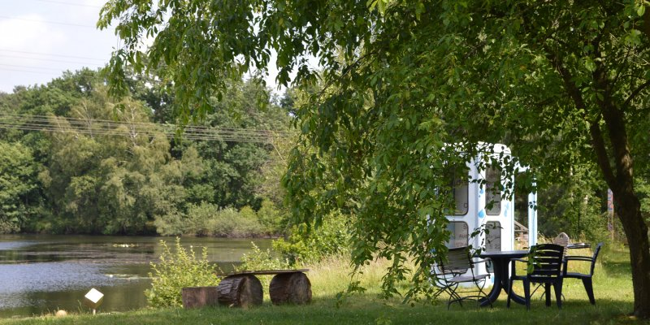

**The yunity heartbeat** - news from the world of sharing, fresh every month.

## [The foodsharing festival](https://www.foodsharing-festival.org/)

## [Utopival](https://ww.utopival.de)
Countdown for utopival has started and with that also final preparations.

A weekend ago almost the entire team came to Ganderkesee for some last days of laptop work and finalizing some thoughts, but also for good food and to enjoy the beautiful place where in less than a week the utopival will start.

 
_Just one pretty view of many on this beautiful site_

The first compost toilets, shower constructions and outdoor stoves were build during some building days and starting on Thursday there will be the final days of building up the camp.

Being at this beautiful place and starting to implement our visions and plans leads to us being able to imagine how beautiful utopival will be! We are so excited and almost impatient for it to begin!

_by findus_

## [Foodsaving Worldwide](https://foodsaving.world)

## [#block-vw](https://autofrei.noblogs.org/)
Okay, I understand that this might not obviously belong into a newsletter about sharing, so I will start with showing the relevance: All of us living creatures share this planet and homo sapiens is about to destroy it through pollution. When there's action being taken to stop that and to thus protect the common good that is the world we live in, I would say that it can very well count as an act of sharing or rather an act of enabling sharing in the future as well... 
And also there were some people from our bubble involved in this specific action so it had to be mentioned... ;)

 
_The banner says 'Transforming traffic instead of ending humanity'_

On August 13 multiple independent groups of climate activists blocked a train full of brand-new cars close to the Volkswagen factory in Wolfsburg. Some locked themselves onto the rails, some roped themselves down from the bridge the train was standing on and some even climbed a giant globe installation in the foyer of the nearby Volkswagen Autostadt (something in between an enterprise headquarters and a car-themed amusement park).

 
_Forcing open the lock-ons required a whole collection of heavy tools..._

The action was meticulously planned and carefully carried out so that nobody was hurt and the train was blocked for almost a day. The people in the globe even stayed overnight and voluntarily left on the next day. Press coverage often employed the term 'spectacular' and was generally not awful (which is good in this case...). They understood the pioneer quality of this action which is the first to target the car industry as a main responsible for climate change. The demands were free public transport, more bike lanes, less focus on cars in general traffic. The topic is growing and this action definitely helped spread further.

_by Janina_

## Sacred Activism research week

The term Sacred Activism stands for the idea that in doing activism we are nature defending itself. That we as human beings are not disconnected but part of the earth and the ecosystem and with our actions we want to show which actions do harm to us.

 
_Participants of the research week standing with the Earth in Berlin_

Following a number of similar events like the [Rebels of Peace symposia](https://www.gemeinschaft-sulzbrunn.de/files/951/rebels-of-peace-sulzbrunn-symposia-10.pdf) and the [Defend the Sacred meeting in Tamera](https://www.tamera.org/events/defend-the-sacred-conference-for-global-change-makers-2/), the [Zegg community](https://www.zegg.de/en/) called for a networking and research week. Amongs them was I as part of the yunity network :-). 20 people who work on inner change and outer change came together to research how these two can be thought and lived together (a topic that was also very present at the MOVE Utopia - [you can read about that in the previous heartbeat](../2019-07-29)).

During this very intense time we were exploring how our fears that root in early childhood keep us from being connected with other people and the world. And how these fears also keep us from doing good in the world! Through a very impressive personal experience I was able to understand what this means to me personally and deeply combine my drive for outer change and my whish for inner work together. Very centrally I discovered that my fear of being alone and not loved that comes from being the oldest sibling and having to do stuff on my own too early is something real. I am learning to observe it in myself when this fear arises and consciously see it influence my mood. Then I have the possibility to act, voice this fear to others, do things which I know help me overcome this fear and in the long run learn how to use this fear as a tool for my life.

During this research week I found out how I can be a sustainable activist and how I can support others in sustaining their activism themselves. Some ideas: - take enough time to recover
- know your limits
- work on your fears
- accept that you are loved and very precious
- don't see yourself separated from anything, not from others not from the world

One concrete outcome was an action on Berlin Alexanderplatz, where 30 people were [standing with the earth](www.standing-with-the-earth.com).

_by Laurina_

## [Karrot](https://karrot.world)

## [Kanthaus](https://kanthaus.online)

## About the heartbeat.
The heartbeat is a monthly summary of what happens in yunity. It is meant to give an overview over our currents actions and topics.

### How to contribute?
Talk to us in [#heartbeat](https://yunity.slack.com/messages/heartbeat/) on [Slack](https://slackin.yunity.org) if you want to add content, change the layout or any other heartbeat related issues and ideas! We are also happy about any kind of feedback!
