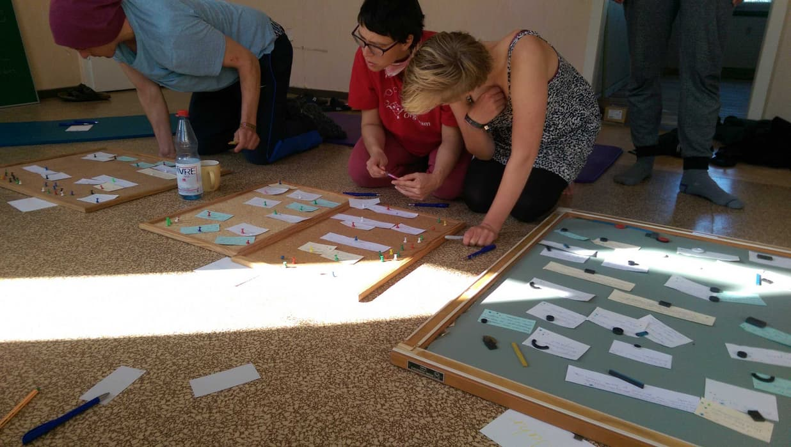
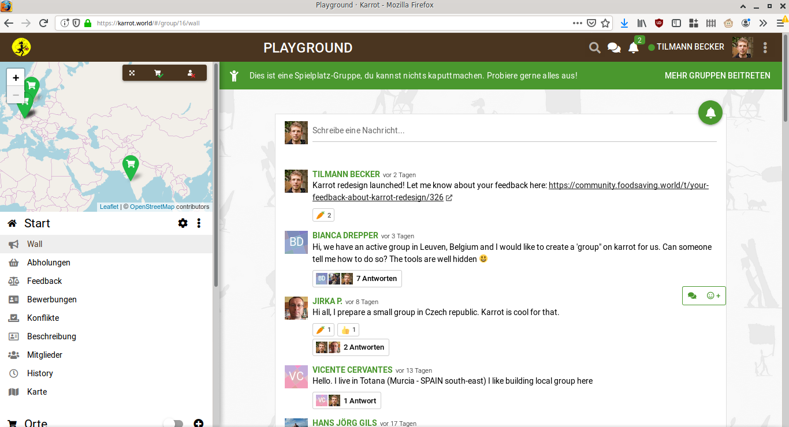

**The yunity heartbeat** - news from the world of sharing, fresh every month.

## [Utopival](https://utopival.de)
"What could tomorrow's sustainable society look like?" One month ago, almost 100 people spent 7 days dealing with exactly this question. In workshops, conversations, encounters and in practice, it was possible to experience at the utopival how such a society could look, feel, sound, taste and smell like. Tasty meals of saved food were cooked over the fire, we sang, danced, bathed in the lake, shared tasks and responsibilities, made new friendships, laughed, cried, talked about racism and children in our society, paths towards climate justice were worked out and much more.
[This article gives a small insight](https://www.noz.de/lokales-dk/ganderkesee/artikel/1866781/wie-in-ganderkesee-eine-woche-lang-ohne-geld-und-konsum-gelebt-wird) (in German).

 
_It all happened in beautiful nature_

If you would like to help prepare the utopival 2020, [please contact us](mailto:kontakt@utopival.de). The first meeting will take place from November 30th to December 1st at [Kanthaus](https://kanthaus.online).

_by findus_

## [gerechte1komma5 – Der Klimaplan von unten](https://gerechte1komma5.de/)

A few days ago, the German campaign „gerechte1komma5“ (in English: fair 1,5) started to write the climate plan from the people. Directly in front of the Chancellery in Berlin, the civil climate cabinet met for the first time to work out fair solutions towards climate justice, which the federal government is unlikely to provide. Watch [this video](https://vimeo.com/362264058) to get an impression of what we are doing.

 
_It started in a prominent location_

We cannot wait for politicians to take action, so people from different social movements, experts, scientists and affected people will contribute their knowledge. Throughout autumn and winter, socially and globally equitable measures will be worked out in the areas of energy democracy, mobility justice, fair housing and spatial planning, fair reproduction, production and consumption, fair agriculture, food sovereignty and forest use, as well as global, social and generational justice. All those measures are meant to limit global warming to 1,5°C.

The climate plan from the people is going to be written in a transparent way and in simple language because it is not going to be another pice of paper to only be put in a drawer. It is explicitly not only meant to be for the government, but to address each and everyone of us!

 
_The work just started..._

It will also be used as a solid theoretical foundation to serve as legitimation for civil disobedience and other forms of creative protest to increase the pressure on the government.

If you know people that could share their knowledge, moderate parts of the writing process or you have some ideas yourself, please contact [gerechte1komma5@posteo.net](mailto:gerechte1komma5@posteo.net).

_by findus_

## [Foodsaving Worldwide](https://foodsaving.world)
Two very motivated people from Czech Republic stumbled across our project recently. One immediately started contributing translations and bug reports to Karrot (thank you very much!) and the other is getting ready to import foodsharing as a whole. We're happy to encounter so much energy and are looking forward to seeing where this might lead!

In Leuven, Belgium, there also is an active foodsaving group that now wants to start using Karrot. Next year they will have a hackathon organized by [FoodWIN](https://foodwin.org/) where Bianca - who wrote to us - is interested in pitching ideas to progress Karrot. This already sounds like a fruitful partnership!

In Stockholm the foodsaving plans get more and more concrete. Bruno is in contact with Naomi, who we know from old yunity days, and apparently there's quite some people wanting to help. The first meeting took place already in April and now the group is getting ready to initiate their first cooperations. We wish them all the best and wait for good news!

_by Janina_

## [Kanthaus](https://kanthaus.online)
Maybe it was a bit late, but we had our very first ever Kanthaus Sommerfest on September 28! Many people came from Wurzen and Leipzig, helped cutting saved veggies in the disco soup, participated in one of the three house tours, listened to us presenting our projects, ate, talked and generally had a good time. We even had live music and fancy light installations next to the obligatory open fires when it got dark. To get a more detailed impression, please read [Lise's blog post](https://kanthaus.online/blog/2019-10-02_sommerfest) about this really successful event!

 
_Concert by Oh No Noh next to the fire_

In the last issue I already mentioned that we review our processes right now. One pretty concrete outcome is the new MCM - which translates to mega, meta or master coordination meeting. It is a meeting with a completely new structure, it takes a whole day and is meant to provide a plan for the coming year of Kanthaus-related work. We had our first MCM on September 22 and it was a very positive experience: All present Kanthausians took part (8 people in total) and in the end everybody described it as a nice communal day of dreaming and planning. The detailed structure can be reviewed [here](https://gitlab.com/kanthaus/kanthaus-public/blob/master/2019-MCM/mcmStructureProposal.md). The result of the day is that we now have a dedicated roof team (Tilmann and Silvan), stuff team (Bodhi, Matthias and Thore) and room team (Nathalie and Janina), which take care of pushing their topics, give information about the current status at every CoMe (coordination meeting, Mondays at 10 am) and gather and integrate other people's opinions. We're all pretty happy to have clearer responsibilities and hope for good progress over the winter!

 
_Gathering needs and wishes was the 1st step_

After I accidentally broke our website by removing two pairs of double quotes, Tilmann built [a service](https://github.com/kanthaus/kanthaus.online/blob/master/test.sh) that automatically tries to access every single subpage on kanthaus.online before applying any changes. Because no, I was definitely not the first or only one to break stuff - this was just the moment where action was taken... ;)

_by Janina_

## [Karrot](https://karrot.world)

Finally, after months of preparation (and sometimes desperation), I released the redesign based on the first non-beta version of the [Quasar UI framework](https://quasar.dev). But it wasn't just about upgrading Quasar, I also fixed and improved some smaller things while I was at it. For example, the topbar search now shows profile pictures next to user names!

With the new release also came major translation updates: Czech, Spanish and Esperanto are on 100%, while German reached 89% - many thanks to the translators, especially Carlos and Jirka!

 
_A screenshot from the slightly redesigned wall. Actually it looks very similar to before!_

[Our weekly call](https://community.foodsaving.world/t/weekly-call-about-karrot-development/289/27) continues since we started it in July. We're usually 3-5 people discussing bits and bobs about Karrot, foodsaving worldwide and sometimes politics. A typical call takes around an hour and is guided through by the facilitator - one of us who volunteered the week before. I think we all find this format helpful to establish more human contact and get some focus on Karrot topics once in a while. If you're interested in joining as well, please feel free to do so!

Also in September, I moved Karrot away from the Sparkpost email service provider because they reduced their free plan dramatically. I went through a week-long journey of finding a good self-hosted solution, setting it up and keeping it running. But it seems worth it! So far, we sent around 14k emails with the new setup. Occasionally I keep an eye on failed email deliveries to see if we ended up on some blacklist, but it seems still fine. If you're interested in more details, you might want to read [my blog post](https://blog.karrot.world/2019/09/25/setting-up-email-service.html).

 
_This is how our new self-hosted email system looks in the web browser. Pretty exciting, if you ask me ;)_

This winter, we are planning to have a "Month of Karrot" in January at [Kanthaus](https://kanthaus.online/). I expect the same cozy and productive atmosphere as last time! :)

_by Tilmann_

## About the heartbeat.
The heartbeat is a monthly summary of what happens in yunity. It is meant to give an overview over our currents actions and topics.

### How to contribute?
Talk to us in [#heartbeat](https://yunity.slack.com/messages/heartbeat/) on [Slack](https://slackin.yunity.org) if you want to add content, change the layout or any other heartbeat related issues and ideas! We are also happy about any kind of feedback!
