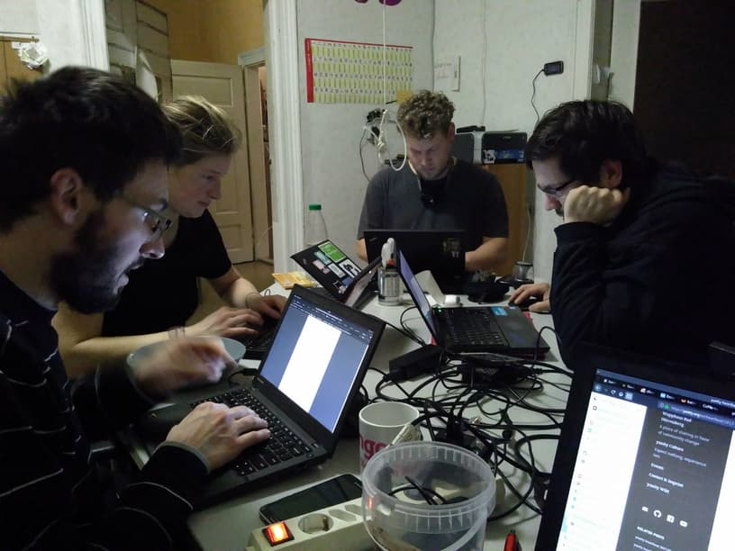

We've had good success in progressing the code as well as in socializing on our hackathons that took place over the last years, so what about doing a whole week of focused coding on our beloved foodsharing.de?

===

The goal is to further progress refactoring of [foodsharing.de](https://foodsharing.de).
Side topics that might come up depending on the participants are
  * fixing some easy to fix, but annoying bugs
  * migrate the mail system to new accounts
  * start work on [foodsharing light](https://beta.light.foodsharing.de) again ([Github Backend](https://github.com/foodsharing-dev/foodsharing-django-api), [Github Frontend](https://github.com/foodsharing-dev/foodsharing-light))

To get more information on the status and the different software projects, please read in our [Devblog](https://devblog.foodsharing.de). Especially the [New contributor notes](https://devblog.foodsharing.de/2017/10/12/new-contributor-notes.html) will be of interest if you never coded on foodsharing.de before.

**As always the whole event is completely free of charge!**

## When and where?

The **foodsharing.de hackweek** will take place from _2018-02-10 to 2018-02-18_ at [Kanthaus](https://kanthaus.online) in Wurzen near Leipzig.

## Who and why?

To strengthen the bonds between code-contributors of all kinds: No matter if you're a foodsharing enthusiast who...
- likes to code in legacy PHP applications
- wants to try out shiny new things in vue.js or django
- would like to get in contact with the developer team to start contributing more easily

If you are interested in foodsaving on a more general term, the [Foodsaving worldwide hackweek](../2018-02-24-fsww-hackweek) might be more relevant to you.

We will:
- improve existing functionality of foodsharing.de by refactoring
- maybe make the light, mobile version more usable
- plan future development roadmap, communication and involvement

Besides that, expect to have a great time in the nice city of Wurzen together with lovely people!

If you have another idea what you would like to do with us, please get in contact. (See end of this article)

## So how will we...

Some questions you can ask yourself to find out if this event is for you.

### ... work?

- Are you willing and able to focus for at least 6 hours per day (except for the first and the last day)?
- Are you excited to self-organize together with people who are as passionate about foodsharing and technology as you are?

### ... eat?

- Are you ready to feast on saved food that comes from dumpster diving and from foodsharing cooperations in the region?
- Are you willing to sort good from perished food, wash it and prepare it together?

### ... sleep?

- Would you mind sleeping in the same room with others? That might mean people coming in late at night and/or talking together in the morning.
- Are you comfortable with sleeping in an unheated room?

### ... get along with other residents?

- Are you aware of others being bothered by rooms or places that are dirty or unorderly?
- Are you willing to participate in communal cleaning parties and take care that your things are not scattered everywhere?
- Are you prepared to read signs which are attached to the walls and act accordingly?

### ... get there?

[Kanthaus](https://kanthaus.online) is located at [Kantstraße 20 in Wurzen](https://www.openstreetmap.org/way/99897633#map=19/51.36711/12.74075), which is approximately 30 km east of Leipzig and not even 10 minutes by foot from the train station in Wurzen.

**By train/bus**: From Leipzig central, there are two kinds of trains to Wurzen: one that takes 17 minutes (RE) and one that takes 40 minutes (S-Bahn). Both go once an hour. Use the travel planner of [mdv](https://www.mdv.de/fahren/fahrtenplaner) or [Deutsche Bahn](http://www.deutschebahn.com/).

**By Hitchhiking**: Passing Leipzig in the North on A14 get off 'Leipzig-Ost' and then take B6 to Wurzen.
Coming from Dresden or passing Leipzig in the South you will reach A14, get off in 'Grimma' and then take B107 to Wurzen.
But be aware of the fact that you probably won't find great spots to hitch new rides after leaving the highway. B6 and B107 don't offer walking lanes, so be sure to start early and arrive when there's still light.

## I want to participate!

If you are interested, please send a [mail to us](mailto:foodsharing-dev@yunity.org) or directly join the #foodsharing-dev channel on [yunity Slack](https://slackin.yunity.org). Inside the channel, you will find people whom you can tell that you are interested in joining.
