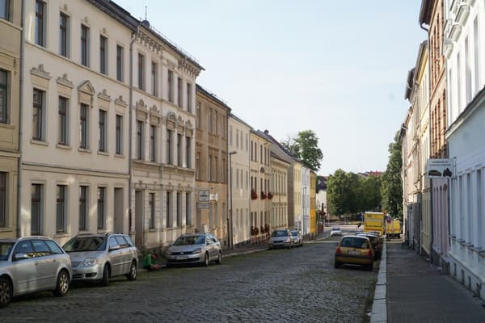

Hackweeks are becoming a tradition and we're proud of that! :D  
Our last [hackweek in September](../2017-09-13-neuried-hackweek), as well as our [hackathon in July](../2017-06-14-hackathon) was enjoyed by everyone (you can read about September in [this heartbeat](/heartbeat/2017-09-17) and about July in [this one](/heartbeat/2017-07-23)). Now we thought it was time for the next one!

===

To further progress [karrot.world](https://karrot.world) and the foodsaving worldwide network, the next hackweek & networking meet-up is planned for the end of February.

**As always the whole event is completely free of charge!**

## When and where?

The **foodsaving worldwide hackweek & networking meet-up** will take place from _2018-02-24 to 2018-03-04_ at [Kanthaus](https://kanthaus.online) in Wurzen near Leipzig.

## Who and why?

To strengthen the bonds between contributors of all kinds: No matter if you're a foodsaving enthusiast who...
- likes to code on [karrot](https://karrot.world),
- wants to try out the software and is up for [reporting bugs](https://slackin.yunity.org),
- loves to [discuss features](https://github.com/yunity/karrot-frontend/issues),
- thrives by building up local communities,
- maintains active cooperations,
- cares for the [worldwide network of foodsavers](https://www.facebook.com/groups/foodsaving.worldwide/),
- is passionate about [translating content](https://www.transifex.com/yunity-1/),
- wants to improve and organize the [knowledge library](https://yunity.atlassian.net/wiki/spaces/FSINT/pages/50069535/Material+to+get+started)

**Everybody is welcome!**

We will:
- improve existing functionality of karrot.world
- plan new features
- improve communication inside and outside of the karrot and foodsaving worldwide team
- think about how to present the extensive knowledge library we created

If you want to know more about karrot.world and foodsaving worldwide, our info page [foodsaving.world](https://foodsaving.world) might be helpful.

Besides that, expect to have a great time in the nice city of Wurzen together with lovely people!

If you have another idea what you would like to do with us, please get in contact. (See end of this article)

## So how will we...

Some questions you can ask yourself to find out if this event is for you.

### ... work?

- Are you willing and able to focus for at least 6 hours per day (except for the first and the last day)?
- Are you excited to self-organize together with people who are as passionate about foodsaving and technology as you are?

### ... eat?

- Are you ready to feast on saved food that comes from dumpster diving and from foodsharing cooperations in the region?
- Are you willing to sort good from perished food, wash it and prepare it together?

### ... sleep?

- Would you mind sleeping in the same room with others? That might mean people coming in late at night and/or talking together in the morning.
- Are you comfortable with sleeping in an unheated room?

### ... get along with other residents?

- Are you aware of others being bothered by rooms or places that are dirty or unorderly?
- Are you willing to participate in communal cleaning parties and take care that your things are not scattered everywhere?
- Are you prepared to read signs which are attached to the walls and act accordingly?

### ... get there?

[Kanthaus](https://kanthaus.online) is located at [Kantstraße 20 in Wurzen](https://www.openstreetmap.org/way/99897633#map=19/51.36711/12.74075), which is approximately 30 km east of Leipzig and not even 10 minutes by foot from the train station in Wurzen.

**By train/bus**: From Leipzig central, there are two kinds of trains to Wurzen: one that takes 17 minutes (RE) and one that takes 40 minutes (S-Bahn). Both go once an hour. Use the travel planner of [mdv](https://www.mdv.de/fahren/fahrtenplaner) or [Deutsche Bahn](http://www.deutschebahn.com/).

**By Hitchhiking**: Passing Leipzig in the North on A14 get off 'Leipzig-Ost' and then take B6 to Wurzen.
Coming from Dresden or passing Leipzig in the South you will reach A14, get off in 'Grimma' and then take B107 to Wurzen.
But be aware of the fact that you probably won't find great spots to hitch new rides after leaving the highway. B6 and B107 don't offer walking lanes, so be sure to start early and arrive when there's still light.

## I want to participate!

If you are interested, please send a [mail to us](mailto:hackweek@foodsaving.world) or directly join the #fsww_hackweek channel on [yunity Slack](https://slackin.yunity.org). Inside the channel, you will find an attendance sheet where you can enter yourself.
